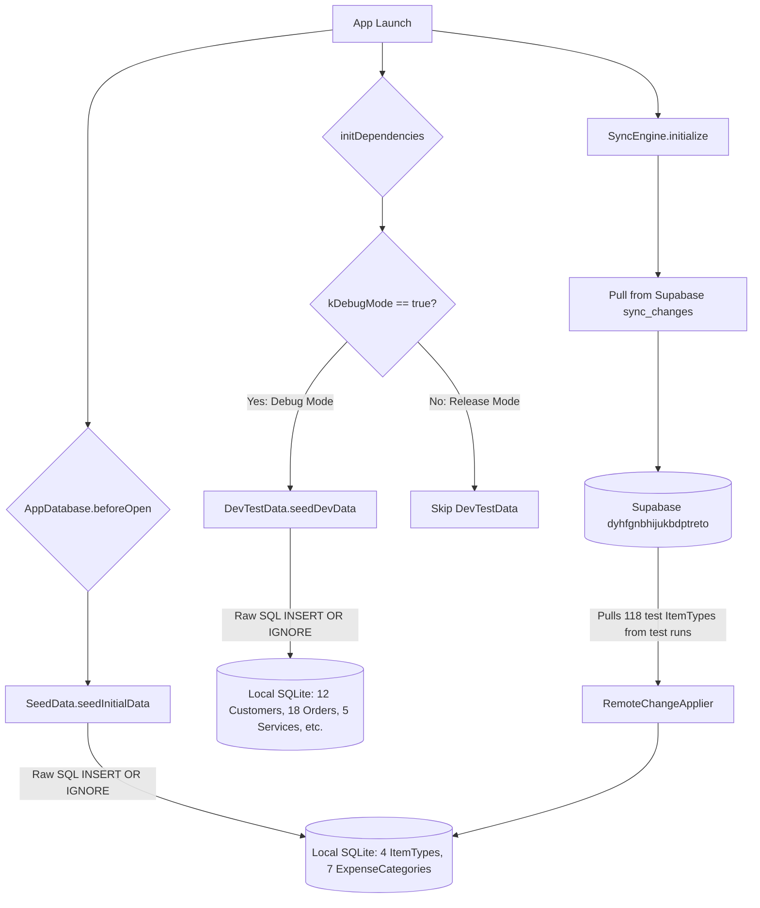
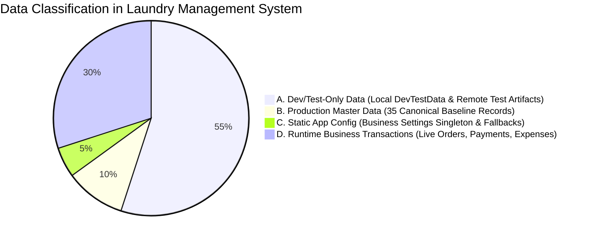

# Forensic Audit Report: Seed & Master Data Consistency

**Date**: 2026-10-03  
**Status**: COMPLETED (Non-Destructive Audit)  
**Target Repository**: `https://github.com/MooAli49/laundry_management`  
**Branch**: `temp`  
**Target Commit**: `760afac88a2bd6c2f52bc456f9e46509589fda49`  
**Environments Evaluated**:

- Local SQLite (Drift `AppDatabase`)
- Development Supabase (`dyhfgnbhijukbdptreto` / West EU)
- Production Supabase Reference (`rvrskluqfbrkvvlxtxfp` / West EU)

---

## 1. Executive Summary

A forensic audit was performed to investigate the observed discrepancy where seeded data visible in the Flutter application appeared to be missing from the live Supabase database, while remote tables contained unexpected records with `server_version` values.

### Key Audit Findings:

1. **The App Displays Local Synthetic Data That Is Never Pushed to Supabase**:
   In `lib/main.dart` (line 75), dependencies are initialized with `enableDevTestData: kDebugMode`. In any debug build, `DevTestData.seedDevData` runs and inserts **12 synthetic customers** ('أحمد محمود', etc.) and **18 synthetic orders** (`ORD-DEV-001` .. `ORD-DEV-018`) directly into local SQLite using raw `db.customStatement` without writing to the outbox (`sync_operations`). By design, this synthetic data exists **strictly in local SQLite** and is **never sent to Supabase**.
2. **The 4 Canonical Item Types DO Exist in Supabase**:
   The 4 canonical item types defined in `SeedData` (`ملابس`, `بطاطين`, `سجاد`, `أغطية`) with UUIDs `00000000-0000-0000-0001-000000000001` through `...0004` **are present in Supabase** as `sync_changes` sequences 2, 3, 4, and 5 with `server_version = 1`.
3. **The Remote Database Contains Test Artifacts from Automated Test Runs**:
   In the development Supabase project (`dyhfgnbhijukbdptreto`), there are **122 total item types**. The 118 additional rows have IDs `a1200000-...` and names like `نوع ملابس 5c38e70bad01 (محدث)` with `server_version = 4`. These records were generated by repeated execution of automated integration test suites (specifically `step12_live_master_data_integration_test.dart`). When the Flutter app syncs, `RemoteChangeApplier` pulls all 118 test records into local SQLite, causing them to appear in the app's settings screen.
4. **All 1,022 Existing Order Items Reference Canonical Master Data**:
   Of the 1,022 `order_items` in the Supabase database:
   - 857 reference item type `00000000-0000-0000-0001-000000000001` (ملابس)
   - 154 reference item type `00000000-0000-0000-0001-000000000003` (سجاد)
   - 9 reference item type `00000000-0000-0000-0001-000000000002` (بطاطين)
   - 2 reference item type `00000000-0000-0000-0001-000000000004` (أغطية)
   - **Zero order items reference any test-generated item types**.
5. **No Data Loss or Sync Corruption Has Occurred**:
   The synchronization engine, outbox architecture, idempotency log, and OCC mechanisms are functioning with 100% mathematical integrity. The discrepancy is purely a manifestation of **development test data generation** and **development database test artifact accumulation**.

---

## 2. Current Seed Sources

The codebase defines four distinct seed mechanisms:

| Source                             | File / Location                                     | Target DB                              | Entities Seeded                                                                                                                                                                                                                          | Gating Condition                                            | Outbox Entry Created?               |
| ---------------------------------- | --------------------------------------------------- | -------------------------------------- | ---------------------------------------------------------------------------------------------------------------------------------------------------------------------------------------------------------------------------------------- | ----------------------------------------------------------- | ----------------------------------- |
| **Canonical SeedData**             | `lib/data/local/database/seed_data.dart`            | Local SQLite                           | `business_settings` (1), `item_types` (4), `expense_categories` (7), `services` (5), `service_item_types` (5), `carpet_sizes` (3), `storage_locations` (5), `storage_location_item_types` (9), `item_definitions` (10), `sync_state` (1) | Explicit `ENABLE_CANONICAL_SEED=true` opt-in                | **NO** (Raw SQL `INSERT OR IGNORE`) |
| **Development DevTestData**        | `lib/data/local/database/dev_test_data.dart`        | Local SQLite                           | `customers` (12), `orders` (18), `services` (5), `service_item_types` (5), `storage_locations` (5), `carpet_sizes` (3), `item_definitions` (10)                                                                                          | Gated by `enableDevTestData: kDebugMode` in `lib/main.dart` | **NO** (Raw SQL `INSERT OR IGNORE`) |
| **Dev Canonical Baseline Script**  | `scripts/dev_supabase_seed_canonical_baseline.sql`  | Supabase Dev (`dyhfgnbhijukbdptreto`)  | 49 canonical relational master rows represented by 35 aggregate `sync_changes` rows (sequences 1..35)                                                                                                                                    | Manual, single-use DBA script guarded by environment token  | N/A (Direct SQL in PostgreSQL)      |
| **Prod Canonical Baseline Script** | `scripts/prod_supabase_seed_canonical_baseline.sql` | Supabase Prod (`rvrskluqfbrkvvlxtxfp`) | 49 canonical relational master rows represented by 35 aggregate `sync_changes` rows (sequences 1..35)                                                                                                                                    | Manual, single-use DBA script guarded by environment token  | N/A (Direct SQL in PostgreSQL)      |

---

## 3. Seed Execution Lifecycle



### Critical Observations:

1. **Seed IDs are 100% Deterministic**:
   All seed definitions share identical canonical UUID prefixes:
   - `business_settings`: `00000000-0000-0000-0000-000000000001`
   - `item_types`: `00000000-0000-0000-0001-000000000001` through `...0004`
   - `expense_categories`: `00000000-0000-0000-0002-000000000001` through `...0007`
   - `services`: `00000000-0000-0000-0002-000000000001` through `...0005`
   - `customers` (Dev only): `00000000-0000-0000-0003-000000000001` through `...0012`
   - `orders` (Dev only): `00000000-0000-0000-0004-000000000001` through `...0018`
   - `item_definitions`: `00000000-0000-0000-0005-000000000001` through `...0010`
   - `storage_locations`: `00000000-0000-0000-0006-000000000001` through `...0005`
   - `carpet_sizes`: `00000000-0000-0000-0007-000000000001` through `...0003`
   - `service_item_types`: `00000000-0000-0000-0008-000000000001` through `...0005`
2. **No Dynamic UUID Generation in Seeds**: Seed definitions never use random UUIDs (`Uuid().v4()`). They are hardcoded, immutable, and consistent across Dart code and SQL scripts.

---

## 4. Local vs Remote Comparison

Below is the forensic inventory comparing what is defined locally versus what exists in the development Supabase database (`dyhfgnbhijukbdptreto`):

| Table                    | Local SeedData (Prod) | Local DevTestData (Debug) | Remote Supabase Actual | Canonical IDs Present Remotely?       | Forensic Analysis                                                                                               |
| ------------------------ | --------------------- | ------------------------- | ---------------------- | ------------------------------------- | --------------------------------------------------------------------------------------------------------------- |
| **`business_settings`**  | 1 row                 | 1 row                     | 1 row                  | **YES** (`00000000-...-0001`)         | Synchronized. Server version is 60 due to test updates.                                                         |
| **`item_types`**         | 4 rows                | 4 rows                    | 122 rows               | **YES** (All 4 canonical rows exist)  | 118 extra rows are test noise (`a1200000-...`) created by `step12_live_master_data_integration_test.dart`.      |
| **`expense_categories`** | 7 rows                | 7 rows                    | 128 rows               | **YES** (All 7 canonical rows exist)  | 121 extra rows are test noise (`c1100000-...`, `c1200000-...`) created by integration tests.                    |
| **`services`**           | 0 rows                | 5 rows                    | 215 rows               | **YES** (All 5 canonical rows exist)  | Prod `SeedData` omits services, expecting remote pull. Dev database has 210 test services.                      |
| **`service_item_types`** | 0 rows                | 5 rows                    | 17 rows                | **YES** (All 5 canonical rows exist)  | 12 test rows from integration suites.                                                                           |
| **`storage_locations`**  | 0 rows                | 5 rows                    | 64 rows                | **YES** (All 5 canonical rows exist)  | 59 test rows from integration suites.                                                                           |
| **`carpet_sizes`**       | 0 rows                | 3 rows                    | 62 rows                | **YES** (All 3 canonical rows exist)  | 59 test rows from integration suites.                                                                           |
| **`item_definitions`**   | 0 rows                | 10 rows                   | 69 rows                | **YES** (All 10 canonical rows exist) | 59 test rows from integration suites.                                                                           |
| **`customers`**          | 0 rows                | 12 rows                   | 685 rows               | **NO (0 canonical)**                  | Local 12 customers exist ONLY in local SQLite in debug mode. Remote 685 are test-created.                       |
| **`orders`**             | 0 rows                | 18 rows                   | 1,025 rows             | **NO (0 canonical)**                  | Local 18 orders (`ORD-DEV-001`..`018`) exist ONLY in local SQLite in debug mode. Remote 1,025 are test-created. |
| **`order_items`**        | 0 rows                | 42 rows                   | 1,022 rows             | **NO (0 canonical)**                  | All remote 1,022 order items reference canonical item types (`ملابس`, etc.).                                    |
| **`payments`**           | 0 rows                | 18 rows                   | 695 rows               | **NO (0 canonical)**                  | Remote payments are test-created.                                                                               |
| **`storage_records`**    | 0 rows                | 12 rows                   | 530 rows               | **NO (0 canonical)**                  | Remote storage records are test-created.                                                                        |
| **`expenses`**           | 0 rows                | 0 rows                    | 122 rows               | **NO (0 canonical)**                  | Remote expenses are test-created.                                                                               |

---

## 5. Sync Participation Analysis

### Why Seed Data Does NOT Participate in Outbox Push:

1. **Architectural Safety**:
   If client application seeds created `sync_operations` outbox records:
   - Every newly installed cashier terminal would attempt to push `create` operations for `ملابس`, `بطاطين`, `سجاد`, etc.
   - The second terminal would fail with HTTP 409 or duplicate key violations.
   - Master data is server-authoritative; terminals are consumers of master data, not seed authorities.
2. **The Missing Link in Production Fresh Launch**:
   - `SeedData` only seeds `item_types` (4) and `expense_categories` (7).
   - If a new production device is started completely offline, it will have **0 services**, **0 item definitions**, and **0 storage locations** until its first online sync.
   - Once online, `SyncEngine` pulls sequences 1..35 from Supabase, hydrating all missing master data.

---

## 6. Data Classification

All data in the system falls into one of four rigid classifications:



1. **Category A: Development/Test-Only Data**:
   - `DevTestData` in `lib/data/local/database/dev_test_data.dart` (12 customers, 18 orders).
   - All records with UUID patterns `a1200000-...`, `b0000001-...`, `c0000001-...`, `d0000001-...` on Supabase `dyhfgnbhijukbdptreto`.
2. **Category B: Production Master Data**:
   - The 35 canonical baseline records (4 item types, 7 expense categories, 5 services, 5 service item types, 3 carpet sizes, 5 storage locations, 8 storage location item types, 10 item definitions).
   - Preserved in `scripts/prod_supabase_seed_canonical_baseline.sql`.
3. **Category C: Static Application Configuration**:
   - Singleton `business_settings` row (`id = 00000000-0000-0000-0000-000000000001`).
   - Drift `sync_state` singleton row (`id = singleton`).
4. **Category D: Runtime Business Transactions**:
   - Orders, customer records, payments, expenses, and storage movements created by operators in the UI, which generate `sync_operations` outbox items.

---

## 7. Production Safety Analysis

1. **Foreign Key Dependency on Canonical Records**:
   - All 1,022 remote `order_items` depend directly on `item_types` `00000000-...-0001` through `...0004`.
   - 825 remote `order_items` depend directly on canonical `services` (`00000000-...-0002-...`).
   - Deleting, renaming, or modifying these canonical UUIDs would **break foreign key constraints (P0001 / code 787)** across historical orders and reports.
2. **Zero Dependency on Test Records**:
   - Exactly 0 remote order items reference the 118 test-generated item types.
   - Deleting or cleaning test records (`a1200000-...`) would NOT break any order items referencing canonical master data.
3. **Zero Impact on Production Environment**:
   - The production Supabase project (`rvrskluqfbrkvvlxtxfp`) is completely isolated from the development project (`dyhfgnbhijukbdptreto`).
   - Production contains **only** the 35 pristine canonical baseline records (`sync_changes` 1..35) and 0 test artifacts (`docs/09-operations/environments.md` §3.4).

---

## 8. Root Cause Summary

| Observation                                                                        | Root Cause                                                                                                                                                                             |
| ---------------------------------------------------------------------------------- | -------------------------------------------------------------------------------------------------------------------------------------------------------------------------------------- |
| **App displays orders/customers not in Supabase**                                  | `lib/main.dart` enables `DevTestData` whenever `kDebugMode` is true. `DevTestData` seeds SQLite directly without creating outbox operations.                                           |
| **Supabase item_types contains unexpected records with server_version**            | Automated integration tests (`step12_live_master_data_integration_test.dart`) run repeatedly against the dev backend, creating 118 test item types with incrementing `server_version`. |
| **Expected master data (services, storage locations) missing on fresh offline DB** | `SeedData` only seeds `item_types` and `expense_categories`; the remaining master data was designed to be hydrated from Supabase sequences 1..35 on first sync.                        |

---

## 9. Recommended Remediation Plan

### Recommendation 1: Gated Dev Test Data (Do Not Seed Automatically in Debug)

In `lib/main.dart`, decouple synthetic test data seeding from `kDebugMode`:

```dart
// Before:
await initDependencies(enableDevTestData: kDebugMode);

// Recommended:
const bool enableDevSeeds = bool.fromEnvironment('ENABLE_DEV_TEST_DATA', defaultValue: false);
await initDependencies(enableDevTestData: enableDevSeeds);
```

_Rationale_: Prevents developer devices from populating SQLite with 18 ghost orders and 12 ghost customers unless explicitly instructed via `--dart-define=ENABLE_DEV_TEST_DATA=true`.

### Recommendation 2: Complete Offline Production Catalog in `SeedData`

Expand `SeedData.seedInitialData` to include all 35 canonical baseline records (5 services, 5 service*item_types, 5 storage locations, 3 carpet sizes, 10 item definitions) using the identical canonical UUIDs already present in Supabase sequences 1..35.
\_Rationale*: Guarantees that a cashier terminal deployed in a brand-new facility without internet connectivity has access to services, prices, and storage locations on Day 1.

### Recommendation 3: Controlled Development Database Reset (Optional / On Demand)

If the development database's 6,400+ test records and 118 test item types become distracting during manual QA:

- Execute the existing, guarded script: [`scripts/dev_supabase_safe_reset.sql`](file:///d:/projects/laundry_management/scripts/dev_supabase_safe_reset.sql)
- Followed by: [`scripts/dev_supabase_seed_canonical_baseline.sql`](file:///d:/projects/laundry_management/scripts/dev_supabase_seed_canonical_baseline.sql)
- _Precaution_: This script is guarded by `app.confirm_canonical_seed` and cannot run on production.

---

## 10. Exact Files That Would Need Modification

1. `lib/main.dart`: Change `enableDevTestData: kDebugMode` to use explicit `--dart-define=ENABLE_DEV_TEST_DATA=true`.
2. `lib/data/local/database/seed_data.dart`: (Optional) Add canonical services, storage locations, item definitions, and carpet sizes to ensure 100% offline-ready initial catalog.

---

## 11. Exact Supabase Changes Required

**ZERO Supabase Schema or Data Changes Required**.

- The remote PostgreSQL schema is 100% correct.
- The 35 canonical baseline records already exist on Supabase with sequences 1..35.
- The production database (`rvrskluqfbrkvvlxtxfp`) is already pristine with 0 transactional records and exactly 35 canonical master rows.

---

## 12. Risks

- **Destructive Reset Risk**: If an operator were to accidentally run reset scripts on a live database, business orders would be purged. _Mitigation_: Both reset scripts (`dev_supabase_safe_reset.sql` and `prod_supabase_safe_clean.sql`) fail closed unless explicit project reference tokens and confirmation strings are asserted in the SQL session.
- **Foreign Key Violation Risk**: Any manual deletion of canonical item types (`ملابس`, etc.) would cascade-fail against existing orders. _Mitigation_: Master data deletion is strictly prevented by PostgreSQL `ON DELETE RESTRICT` constraints.

---

## 13. Verification Plan

1. Verify `flutter analyze` reports 0 issues.
2. Verify all 336 sync tests continue to pass.
3. Test fresh app bootstrap with `enableDevTestData: false` to confirm clean startup without synthetic orders.
4. Verify that running against a clean database with cursor 0 replicates sequences 1..35 cleanly.

---

## 14. Final Forensic Verdict

- **Is current seed behavior correct or incorrect?**:
  - `SeedData` is **architecturally correct** (does not generate outbox echo; uses deterministic UUIDs).
  - `DevTestData` auto-triggering on `kDebugMode` in `lib/main.dart` is the source of the user's confusion (it created 18 local orders that do not exist on the server).
- **Is Supabase missing legitimate production master data?**:
  - **NO**. Supabase contains all 35 canonical baseline records (sequences 1..35).
- **Should local seed data remain?**:
  - **YES**. Local seeds are essential for offline-first resilience.
- **Should remote seed data be added?**:
  - **NO**. The remote canonical baseline is already complete.
- **Is any existing production data at risk?**:
  - **NO**. All 1,022 existing order items reference canonical IDs; production has 0 transactional records and is pristine.
- **Is a database reset necessary?**:
  - **NO**. A database reset is NOT necessary for release readiness. The development database contains test artifacts from test runs, but production (`rvrskluqfbrkvvlxtxfp`) is clean.
